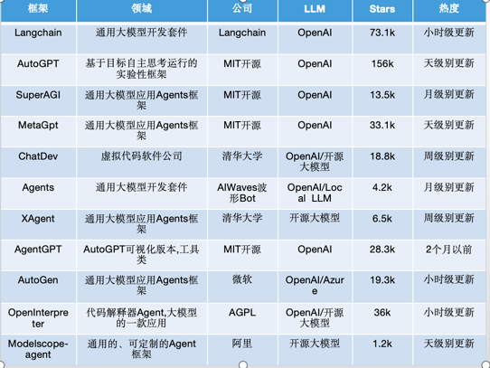
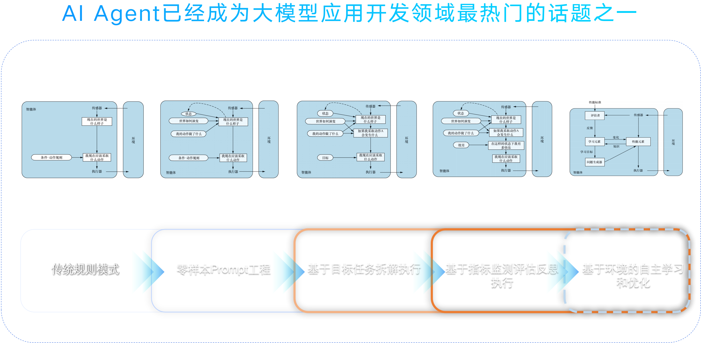

# 智能体框架AutoGen深入体验及部分思考

## 背景

大模型爆发，AIAgent爆发，AIAgent Framework也在爆发,各家都提前在agent领域布局各自的框架类基础设施。

前有`AutoGPT`,`chatDev`, `Langchain`, `MetaGPT`, `SuperAGI`, `AgentGPT` 一众框架平台出圈，从23年下半年到2024年初，

`AutoGen`, `Langflow` ,`LangGraph`, `OpenAgents`，`Gpt_Pilot`， `Devin`, `OpenDevin`, `AIOS`等又火速升温。

这一切的一切都在体现着 `AI Agent`在行业成为新宠。 今天我们来从偏技术的角度剖析微软开源的`AutoGen框架`。

请耐心读完，读完你可能会发现，什么都没有。。。

## 何为 Agent？ 何为 AI Agent

一直以来大家对Agent的定义都是不太清晰的，究其本源，还是因为Agent的定义过于宽泛，仿佛万物皆可Agent。

再加上一个 AI 限定， 摇身一变成为`智能体`。

***在大模型的背景下， `Agent`一词已经逐渐默认为 `智能体` 和 `AI Agent`***

### AI Agent定义

可以实现自主理解、长期记忆、规划决策、执行复杂任务的 `Agent`

### AI Agent和大模型的关系

破除大模型有脑无手的困局， 不仅可以教会用户如何做，更加会执行。

以上两个定义都是有些宽泛的，如果有更加明确标准的定义还请私信联系我交流探讨。

## 走近 AutoGen

* AutoGEN的几个典型案例

## 

