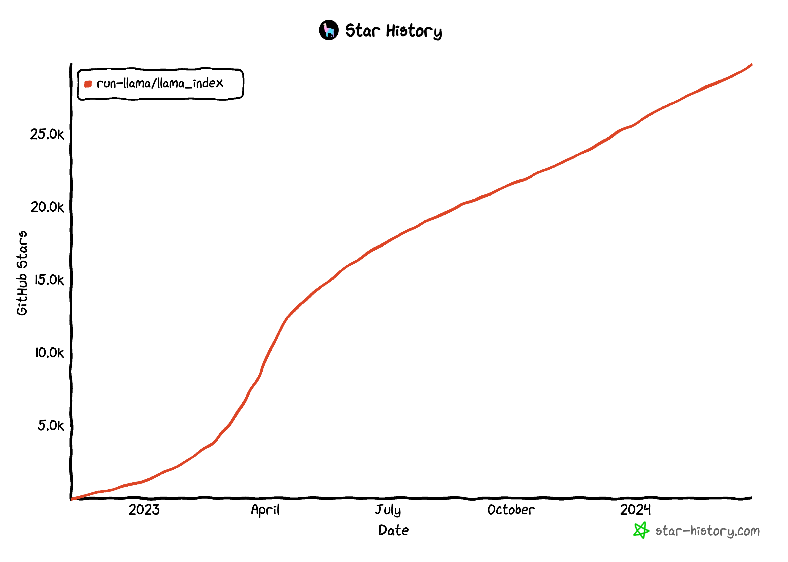
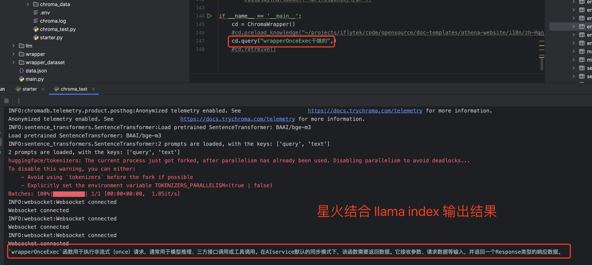

# 零门槛 星火大模型+LLamaIndex +(spark-ai-python) 快速构建小型本地知识库

本文介绍了如何快速构建一个小型知识库， 并使用本项目让Llama-index项目支持星火大模型

## 项目地址

* Github: [https://github.com/iflytek/spark-ai-python](https://github.com/iflytek/spark-ai-python)
欢迎点赞，star


### 背景介绍

[LLamaIndex](https://github.com/run-llama/llama_index) 项目的火热度不用在这里赘述了， 在社区以及业界也是 rag框架的翘楚。



### 正文 

在开始之前请自行使用conda创建一个全新的python环境。

```bash
conda create -n llama_index_test python=3.11
conda activate llama_index_test

```

#### 准备本地知识库

提前准备一个知识库文件夹， 内部可以是多个markdown文档，这里不做赘述

#### 准备向量库，向量模型

向量库我们使用的是 `chromadb` 这个是个比较轻量级的向量库， 相比elastisearch等其他 llamaindex支持的向量库是更轻量，更加便携，比较适用于开发阶段。

参考文档: [chromadb](https://docs.llamaindex.ai/en/stable/examples/vector_stores/ChromaIndexDemo/)


##### 向量库服务端(当然你也可以使用星火的向量服务[后续sdk也会支持星火向量服务]，这里chromadb更加轻量和本地)

```bash
pip install chromadb
pip install llama-index
pip install llama-index-vector-stores-chroma   llama-index-readers-chroma     

```
chroma 支持几种模式 `in-memory` 内存模式， 还有 `in-memory` 加持久化模式， docker模式

`in-memory` 向量存储在内存，进程结束就找不到了，所以每次都得重新 索引data 。

在这里我们使用 第二种模式

直接 `chroma run `, 会在前台运行一个 chroma api服务

```bash


                (((((((((    (((((####
             ((((((((((((((((((((((#########
           ((((((((((((((((((((((((###########
         ((((((((((((((((((((((((((############
        (((((((((((((((((((((((((((#############
        (((((((((((((((((((((((((((#############
         (((((((((((((((((((((((((##############
         ((((((((((((((((((((((((##############
           (((((((((((((((((((((#############
             ((((((((((((((((##############
                (((((((((    #########

    

Running Chroma

Saving data to: ./chroma_data
Connect to chroma at: http://localhost:8000
Getting started guide: https://docs.trychroma.com/getting-started


INFO:     [27-03-2024 16:43:25] Set chroma_server_nofile to 65535
INFO:     [27-03-2024 16:43:25] Anonymized telemetry enabled. See                     https://docs.trychroma.com/telemetry for more information.
DEBUG:    [27-03-2024 16:43:25] Starting component System
DEBUG:    [27-03-2024 16:43:25] Starting component OpenTelemetryClient
DEBUG:    [27-03-2024 16:43:25] Starting component SimpleAssignmentPolicy
DEBUG:    [27-03-2024 16:43:25] Starting component SqliteDB
DEBUG:    [27-03-2024 16:43:25] Starting component QuotaEnforcer
DEBUG:    [27-03-2024 16:43:25] Starting component Posthog
DEBUG:    [27-03-2024 16:43:25] Starting component LocalSegmentManager
DEBUG:    [27-03-2024 16:43:25] Starting component SegmentAPI
INFO:     [27-03-2024 16:43:25] Started server process [30557]
INFO:     [27-03-2024 16:43:25] Waiting for application startup.
INFO:     [27-03-2024 16:43:25] Application startup complete.
INFO:     [27-03-2024 16:43:25] Uvicorn running on http://localhost:8000 (Press CTRL+C to quit)

```

***chroma 执行目录当前会有一个 chroma_data 数据目录，里面的sqlite持久化存储了客户的存的向量数据***

##### 向量库客户端

接下来我们开始建立索引，也就是把本地文档向量化并持久化到chromadb
直接上代码

```python
import chromadb
from dotenv import load_dotenv
from llama_index.core import SimpleDirectoryReader, StorageContext, VectorStoreIndex, Settings
from llama_index.core.embeddings import resolve_embed_model

from llama_index.vector_stores.chroma import ChromaVectorStore
class XX:
    def __init__(self):
        self.chroma_client = chromadb.HttpClient(host="localhost", port=8000, ssl=False)
        self.chroma_collection = self.chroma_client.get_or_create_collection("quickstart")
        
    def init_embed_model(self):
        # define embedding function
        self.embed_model = resolve_embed_model("local:BAAI/bge-m3")

    def preload_knowledge(self, dir_path="/Users/yangyanbo/projects/iflytek/code/opensource/doc-templates/athena-website/docs"):
        # load documents
        Settings.chunk_size = 1024
        Settings.chunk_overlap = 20

        reader = SimpleDirectoryReader(dir_path, recursive=True)
        documents = reader.load_data(num_workers=4)
        # set up ChromaVectorStore and load in data
        vector_store = ChromaVectorStore(chroma_collection=self.chroma_collection)
        self.storage_context = StorageContext.from_defaults(vector_store=vector_store)
        VectorStoreIndex.from_documents(
            documents, storage_context=self.storage_context, embed_model=self.embed_model
        )
```

这里Settings的两个配置是用于配置文档分块大小和可重叠token大小。
详细解释如下:

chunk_size: 对输入文本序列进行切分的最大长度。大语言模型一般会限制最大输入序列长度,比如GPT-3的最大输入长度是2048个token。为了处理更长的文本,需要切分成多个chunk,chunk_size控制每个chunk的最大长度。
chunk_overlap: 相邻两个chunk之间的重叠token数量。为了保证文本语义的连贯性,相邻chunk会有一定的重叠。chunk_overlap控制这个重叠区域的大小。

reader 使用了`SimpleDirectoryReader` 来做一个并行的文档加载，并且子目录递归循环。

`VectorStoreIndex.from_documents` 使用了 embed_model 模型对 上述加载的文档做了向量化和存储。

ok到这里知识向量索引就结束了。在这里我们用了 huggingface 比较或的 embedding模型 `BAAI/bge-m3` 支持中英文，当然我们也可以自行替换其它embedding方案

现在你可以定一个检索函数来查询

```python

    def retreive(self, q="wrapperOnceExec干啥的",similarity_top_k=10):
        chroma_collection = self.chroma_client.get_or_create_collection("quickstart")
        vector_store = ChromaVectorStore(chroma_collection=chroma_collection)
        index = VectorStoreIndex.from_vector_store(
            vector_store,
            embed_model=self.embed_model,
        )
        retr = index.as_retriever(similarity_top_k=similarity_top_k)
        response = retr.retrieve(q)
        print(response)
```
调用该函数即可让chroma 根据 q内容检索你的知识库。


*这些都不是重点！ 重点来了*

原本你想用llama_index 你可能要写一堆，现在有了 [spark-ai-python](https://github.com/iflytek/spark-ai-python) SDK so easy!!!

#### 接入LLM 并对接 星火大模型
你只需要
```bash
pip install 'spark-ai-python[llama_index]' --upgrade
```
然后在代码中引入

```python
from sparkai.frameworks.llama_index import SparkAI
```

然后实例化这个SparkAI就可以让llama_index 支持 ***[星火大模型](https://xinghuo.xfyun.cn/)***


完整代码如下：
```python

#!/usr/bin/env python
# coding:utf-8
""" 
@author: nivic ybyang7
@license: Apache Licence 
@file: chroma_test.py
@time: 2024/03/27
@contact: ybyang7@iflytek.com
@site:  
@software: PyCharm 

# code is far away from bugs with the god animal protecting
    I love animals. They taste delicious.
              ┏┓      ┏┓
            ┏┛┻━━━┛┻┓
            ┃      ☃      ┃
            ┃  ┳┛  ┗┳  ┃
            ┃      ┻      ┃
            ┗━┓      ┏━┛
                ┃      ┗━━━┓
                ┃  神兽保佑    ┣┓
                ┃　永无BUG！   ┏┛
                ┗┓┓┏━┳┓┏┛
                  ┃┫┫  ┃┫┫
                  ┗┻┛  ┗┻┛ 
"""

#  Copyright (c) 2022. Lorem ipsum dolor sit amet, consectetur adipiscing elit.
#  Morbi non lorem porttitor neque feugiat blandit. Ut vitae ipsum eget quam lacinia accumsan.
#  Etiam sed turpis ac ipsum condimentum fringilla. Maecenas magna.
#  Proin dapibus sapien vel ante. Aliquam erat volutpat. Pellentesque sagittis ligula eget metus.
#  Vestibulum commodo. Ut rhoncus gravida arcu.

import logging
import os
import sys
import chromadb
from dotenv import load_dotenv
from llama_index.core import SimpleDirectoryReader, StorageContext, VectorStoreIndex, Settings
from llama_index.core.embeddings import resolve_embed_model

from llama_index.vector_stores.chroma import ChromaVectorStore
# from llama_index.llms.ollama import Ollama
# from llama_index.llms.openai import OpenAI

from sparkai.frameworks.llama_index import SparkAI

logging.basicConfig(stream=sys.stdout, level=logging.INFO)
logging.getLogger().addHandler(logging.StreamHandler(stream=sys.stdout))


class ChromaWrapper(object):

    def __init__(self):
        self.chroma_client = chromadb.HttpClient(host="localhost", port=8000, ssl=False)
        self.chroma_collection = self.chroma_client.get_or_create_collection("quickstart")

        self.init_embed_model()

        # ollama
        #self.olamma = Ollama(model="mistral", request_timeout=30.0)

        load_dotenv()
        self.sparkai = SparkAI(
            spark_api_url=os.environ["SPARKAI_URL"],
            spark_app_id=os.environ["SPARKAI_APP_ID"],
            spark_api_key=os.environ["SPARKAI_API_KEY"],
            spark_api_secret=os.environ["SPARKAI_API_SECRET"],
            spark_llm_domain=os.environ["SPARKAI_DOMAIN"],
            streaming=False,
        )
    def init_vector(self):
        pass

    def init_embed_model(self):
        # define embedding function
        self.embed_model = resolve_embed_model("local:BAAI/bge-m3")


    def preload_knowledge(self, dir_path="/Users/yangyanbo/projects/iflytek/code/opensource/doc-templates/athena-website/docs"):
        # load documents
        Settings.chunk_size = 1024
        Settings.chunk_overlap = 20

        reader = SimpleDirectoryReader(dir_path, recursive=True)
        documents = reader.load_data(num_workers=4)
        # set up ChromaVectorStore and load in data
        vector_store = ChromaVectorStore(chroma_collection=self.chroma_collection)
        self.storage_context = StorageContext.from_defaults(vector_store=vector_store)
        VectorStoreIndex.from_documents(
            documents, storage_context=self.storage_context, embed_model=self.embed_model
        )
        
    def retreive(self, q="wrapperOnceExec干啥的",similarity_top_k=10):
        chroma_collection = self.chroma_client.get_or_create_collection("quickstart")
        vector_store = ChromaVectorStore(chroma_collection=chroma_collection)
        index = VectorStoreIndex.from_vector_store(
            vector_store,
            embed_model=self.embed_model,
        )
        retr = index.as_retriever(similarity_top_k=similarity_top_k)
        response = retr.retrieve(q)
        print(response)

    def query(self,q):

        # Query Data
        chroma_collection = self.chroma_client.get_or_create_collection("quickstart")
        vector_store = ChromaVectorStore(chroma_collection=chroma_collection)

        index = VectorStoreIndex.from_vector_store(
            vector_store,
            embed_model=self.embed_model,
        )
        # Query Data from the persisted index
        query_engine = index.as_query_engine(llm=self.sparkai,similarity_top_k=4)
        response = query_engine.query(q)
        print(response)
        #display(Markdown(f"<b>{response}</b>"))

if __name__ == '__main__':
    cd = ChromaWrapper()
    #cd.preload_knowledge("~/projects/iflytek/code/opensource/doc-templates/athena-website/i18n/zh-Hans")
    cd.query("wrapperOnceExec干啥的",)
    #cd.retreive()
```

代码执行效果如下:



